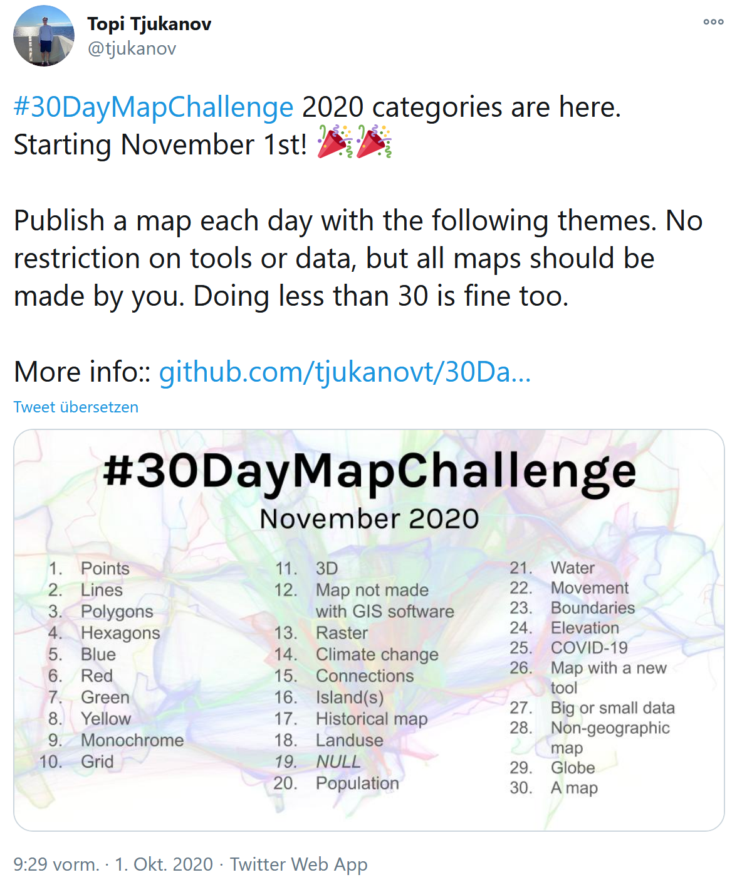
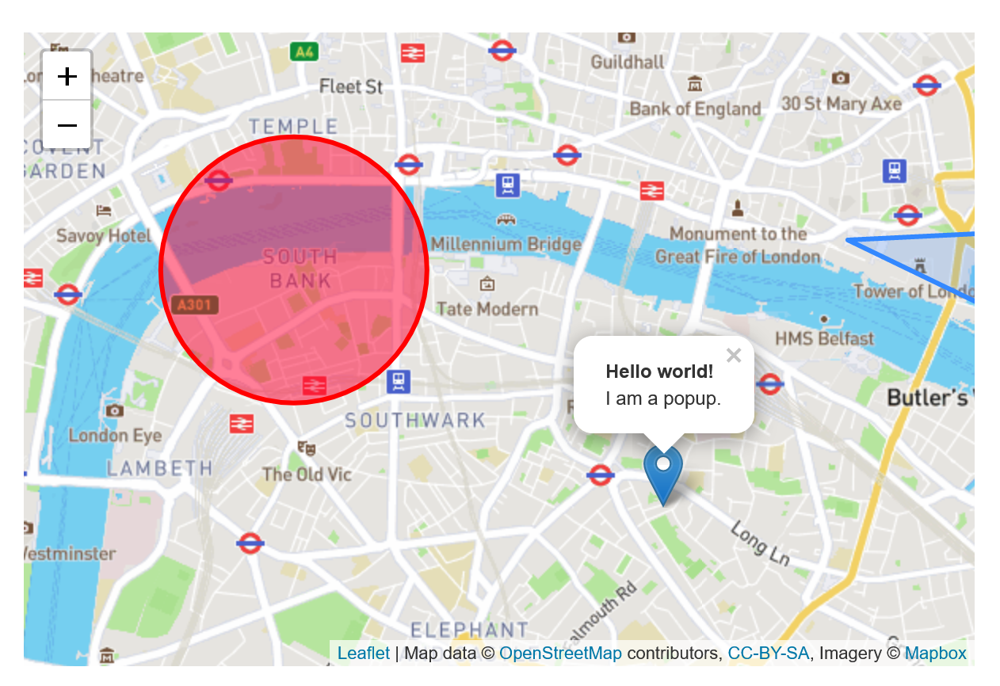
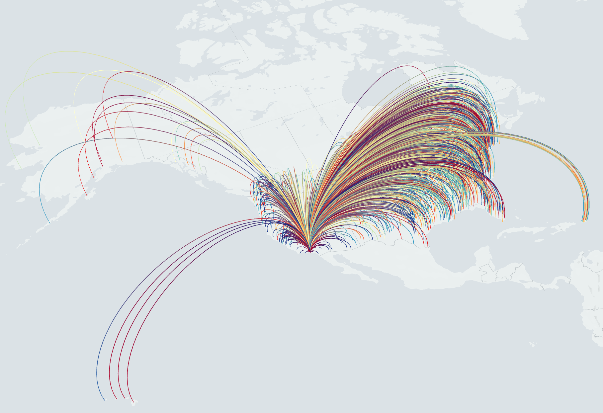
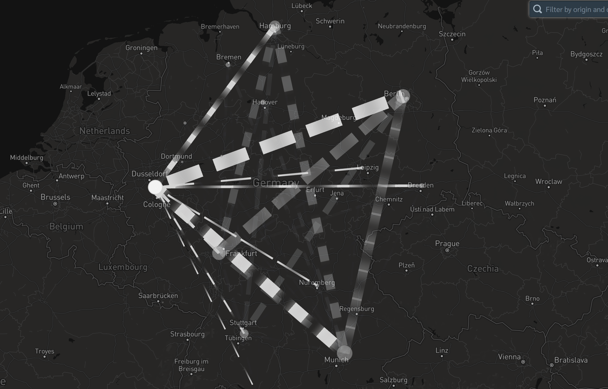
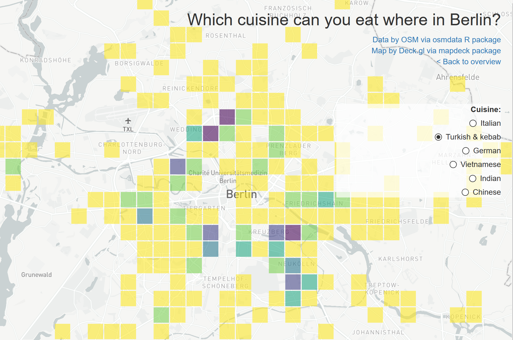
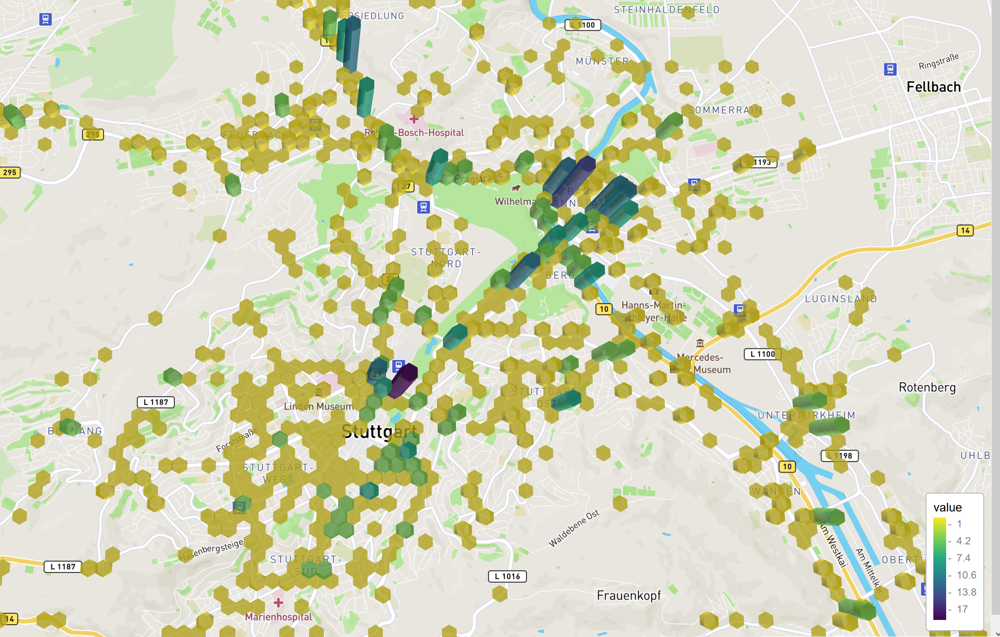

# 
<h3>What is the #30dayMapChallenge?</h3>



# 
<h3>My submission to the challenge</h3>
- ~ 15 days of the 30 days
- today I will present 10 of the maps
- (mostly) interactive maps with R
- Frameworks for interactive maps:
  - Leaflet
  - Deck.gl (*Package: mapdeck*)
  
## Leaflet
- leading open-source JavaScript library
- has been around for ~ 10 years
- usually when you see maps online, they are made with Leaflet



## Deck.gl
- started ~ 4 years ago
- especially great for large data and 3D views
- R package to access deck.gl: *mapdeck*




# Day 1 
<h3>*Points*</h3>
## plotting all + 80.000 cars in Friedrichshain-Kreuzberg

<iframe id = "map" data-src="img/day1.html"></iframe>

## geocomputation made easy with the *sf* package

<section style="text-align: left;">

- crop polygon to outline of another polygon

```{r, eval = FALSE}
streets_in_xhain <- st::st_intersection(streets_berlin, 
                                        xhain_outline) 
```

- sample points in a polygon

```{r, eval = FALSE}
cars <- st::st_sample(streets_xhain,size= 80808)
```

</section>
# Day 8 
<h3>*Yellow*</h3>   

##

<iframe id = "map_full_screen" data-src="img/day8.html"></iframe>


## Plot raster data with *leaflet* and *leafem*

- add raster data: *leaflet::addRasterImage()*
- add Mouseover for raster data: *leafem::addImageQuery()*

```{r, eval = FALSE}
leaflet() %>% 
    addProviderTiles(providers$CartoDB.DarkMatter) %>%
    addRasterImage(hours_of_sunshine, group = "g") %>% 
    addImageQuery(hours_of_sunshine, layerId = "g")
```

# Day 3
<h3>*Polygons*</h3>

## Which boulder gym is closest to you?

<iframe id = "map" data-src="img/day3.html"></iframe>
  
## Create a geospatial voronoi map mit *dismo*

```{r, eval = FALSE}
gyms_voronoi <- dismo::voronoi(boulder_gyms[c("lon", "lat")])
```

# Day 14
<h3>*Climate Change*</h3>

## How large is the area of in 2019 destroyed rain forest?

<iframe id = "map" data-src="img/day14.html"></iframe>

## *leafpm* for editable polygons

- *leafpm::addPmToolbar()* to draw, cut, edit and move vectors

```{r, eval = FALSE}
  leaflet(rainforest_area) %>%
    addTiles() %>%
    addPolygons(group = "p") %>% 
    leafpm::addPmToolbar(targetGroup = "p")
```

# Day 9
<h3>*Monochrome*</h3>

##

<iframe id = "map_full_screen" data-src="img/day9.html"></iframe>


## use *stplanr* for routing and aggregating lines

```{r, eval = FALSE}
start_points <- st_sample(berlin,size=500) %>% st_as_sf
end_points <- st_sample(berlin,size=500) %>% st_as_sf

routes <- stplanr::route(from = start_points, 
                to = end_points, 
                route_fun = osrmRoute,
                returnclass = "sf")

routes["count"] <- 1

overlapping_segments <- stplanr::overline(routes, attrib = "count")
```

# Day 20
<h3>*Population*</h3>

##

<iframe id="map_full_screen" data-src="https://lxndrkp.shinyapps.io/day20/"/>

## react to clicks on *leaflet* map with *shiny*

```{r, eval = FALSE}
observeEvent(input$map_shape_click, {})
```

## Backup image

<video data-autoplay src="img/day20.mp4"></video>

# Day 2
<h3>*Lines*</h3>

## Air traffic between German Airports

<iframe id = "map" data-src="img/day2.html"></iframe>


## Origin destination with *flowmap.blue*

- [Flowmap.blue](https://flowmap.blue/)
- fast and easy viz of origin destination data
- can be done entirely without coding (with Google Sheets)
- new: also available as R package

## Backup image



# Day 10
<h3>*Grid*</h3>

##

<iframe id = "map_full_screen" data-src="https://lxndrkp.shinyapps.io/day10/"></iframe>

## get OSM data with *osmdata*

- OpenStreetMap overs a huge ressource on openly available geodata (streets, rivers, restaurants, stores, ... )
- this data can be retrieved with the [Overpass API](https://wiki.openstreetmap.org/wiki/Overpass_API) which is accesible with the *osmdata* package in R

```{r, eval = FALSE}
osmdata::opq(bbox = 'berlin germany') %>%
     add_osm_feature(key = 'amenity', 
                     value = c('fast_food', 'restaurant')) %>% 
     osmdata_sf ()
```

## auto aggregated grids with *mapdeck*

- insert point data
- point counts are automatically aggregated to grids

```{r, eval = FALSE}
mapdeck::mapdeck() %>% 
 mapdeck::add_screengrid(data = restaurants)
```

## Backup image



# Day 4
<h3>*Hexagons*</h3>

## All traffic accidents in Stuttgart

<iframe id = "map" data-src="img/day4.html"></iframe>

## elevation and hexagons with *mapdeck*

- insert point data
- point counts are automatically aggregated to hexagons

```{r, eval = FALSE}
mapdeck::mapdeck() %>% 
 mapdeck::add_hexagon(data = accidents_stuttgart)
```

## Backup image



# Day 22
<h3>*Movement*</h3>

## all U-Bahns in Berlin

<video data-autoplay src="img/day22.mp4"></video>

## moving lines with *mapdeck*

```{r, eval = FALSE}
mapdeck::mapdeck() %>% 
 mapdeck::add_trips(data = ubahn)
```

# Thanks for your attention!

- [Presentation](https://alexandrakapp.github.io/correlcon_presentation/)

  <span style="font-size: 18px">https://alexandrakapp.github.io/correlcon_presentation/</span>
  
- [Examples & Code](https://alexandrakapp.github.io/30daymapchallenge/)

  <span style="font-size: 18px">https://alexandrakapp.github.io/30daymapchallenge/</span>
  
- [Twitter](https://twitter.com/lxndrkp) @lxndrkp
- [GitHub](https://github.com/AlexandraKapp) AlexandraKapp

